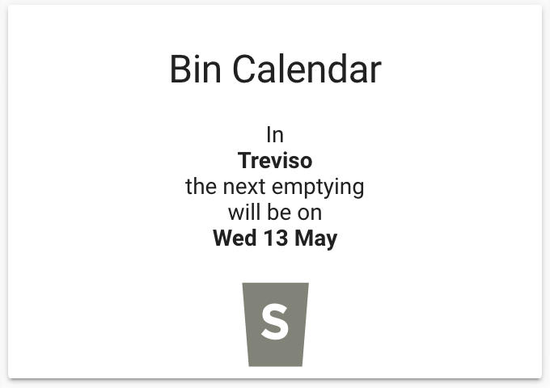

# Bincalendar Card by [@blackwiz4rd](https://www.github.com/blackwiz4rd)

Built by using [Boilerplate Card](https://github.com/custom-cards/boilerplate-card)



### How does Bincalendar Card work?

In bincalendar-card you must create your own parser for the calendar to which you are referencing to. You can upload your calendar in a JSON format (use online converters if the calendar you have is not formatted as JSON).

You can store your bin calendar on a JSON file using [npoint](https://www.npoint.io).

The bincalendar-card makes an http request to your online JSON, provided as a `url` parameter in the lovelace configuration (see options), and uses `/src/bincalendar-parser.ts` to parse the JSON content.

### How do I create my own parser?

To create your own parser, you need to edit `/src/bincalendar-parser.ts`.

In `/src/bincalendar-parser.ts` you must build your own `parseReply` function which must return:

1. The next emptying date as a `Date` object.

2. The *bins_count*. The *bins_count* is a dictionary having 1 if the bin will be emptied, and 0 if the bin won't be emptied on the next emptying date. For example: {paper: 1, plastic: 0}. This means paper will be emptied.

The *bins_count* must match the bins option specified in lovelace configuration.

The *images* must be in the same order as in *bins* option specified in lovelace configuration. You can provide your own image for each bin you specify.

## Options

| Name              | Type    | Requirement  | Description                                 | Default             |
| ----------------- | ------- | ------------ | ------------------------------------------- | ------------------- |
| entity            | string  | **Required** | Home Assistant entity ID.                   |
| type              | string  | **Required** | `custom:bincalendar-card`                   |
| city              | string  | **Required** | Name of the city for calendar               |
| bins              | object  | **Required** | Types of bins                               |
| images            | object  | **Required** | List of images                              |
| url               | string  | **Required** | The url for the service                     |
| port              | string  | **Required** | Port for the service                        |
| name              | string  | **Required** | Card name                                   |                     |
| show_error        | boolean | **Optional** | Show what an error looks like for the card  | `false`             |
| show_warning      | boolean | **Optional** | Show what a warning looks like for the card | `false`             |
| tap_action        | object  | **Optional** | Action to take on tap                       | `action: more-info` |
| hold_action       | object  | **Optional** | Action to take on hold                      | `none`              |
| double_tap_action | object  | **Optional** | Action to take on hold                      | `none`              |

## Action Options

| Name            | Type   | Requirement  | Description                                                                                                                            | Default     |
| --------------- | ------ | ------------ | -------------------------------------------------------------------------------------------------------------------------------------- | ----------- |
| action          | string | **Required** | Action to perform (more-info, toggle, call-service, navigate url, none)                                                                | `none` |
| navigation_path | string | **Optional** | Path to navigate to (e.g. /lovelace/0/) when action defined as navigate                                                                | `none`      |
| url             | string | **Optional** | URL to open on click when action is url. The URL will open in a new tab                                                                | `none`      |
| service         | string | **Optional** | Service to call (e.g. media_player.media_play_pause) when action defined as call-service                                               | `none`      |
| service_data    | object | **Optional** | Service data to include (e.g. entity_id: media_player.bedroom) when action defined as call-service                                     | `none`      |
| haptic          | string | **Optional** | Haptic feedback for the [Beta IOS App](http://home-assistant.io/ios/beta) _success, warning, failure, light, medium, heavy, selection_ | `none`      |
| repeat          | number | **Optional** | How often to repeat the `hold_action` in milliseconds.                                                                                 | `none`      |

## Edit bincalendar-card

### Step 1

Clone this repository

### Step 2

Install necessary modules (verified to work in node 8.x)
`yarn install` or `npm install`


### Step 3

Do a test lint & build on the project. You can see available scripts in the package.json
`npm run build`


## Edit bincalendar-card

Note: this is available only in vscode ensure you have the [Remote Containers](https://marketplace.visualstudio.com/items?itemName=ms-vscode-remote.remote-containers) extension installed.

1. Fork and clone the repository.
2. Open a terminal on bincalendar-card directory and run `npm start` when it's ready.
3. The compiled `.js` file will be accessible on
   `http://127.0.0.1:5000/bincalendar-card.js`.
4. On a running Home Assistant installation add this to your Lovelace
   `resources:`

```yaml
- url: "http://127.0.0.1:5000/bincalendar-card.js"
  type: module
```
5. Upload your bin images to: `home/yourhomeassistantuser/.homeassistant/www/icons`
6. Example of configuration on a running Home Assistant installation add this to your Lovelace `cards`:

```yaml
- entity: bincalendar
  action: none
  bins:
    - Secco
    - Carta
    - Umido
    - VPL
    - Vegetale
  city: New York
  images:
    - /local/icons/s.png
    - /local/icons/c.png
    - /local/icons/u.png
    - /local/icons/v.png
    - /local/icons/vg.png
  name: Bin Calendar
  type: 'custom:bincalendar-card'
  url: 'https://yourdomain.org'
```

7. Search the repository for all instances of "TODO" and handle the changes/suggestions

_Change the url to the JSON file of your calendar. You can store your bin calendar on a JSON file using [npoint](https://www.npoint.io). If your calendar is in ical format, convert it to json using online resources._

## After you are done editing

1. Lint & build on the project.
   `npm run build`
2. Upload `/dist/bincalendar-card.js` to `home/yourhomeassistantuser/.homeassistant/www`
3. Change your Lovelace configuration to:
   `resources:`

```yaml
- url: /local/bincalendar-card.js
  type: module
```
## Support - Boilerplate Card (not me)

Hey dude! Help me out for a couple of :beers: or a :coffee:!

[](https://www.buymeacoffee.com/zJtVxUAgH)
